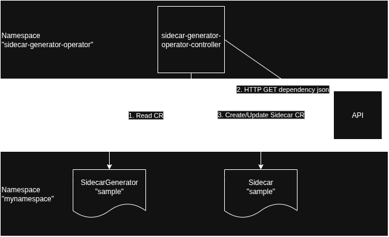

# sidecar-generator-operator



## Behavior

1. SidecarGenerator CR only creates a Sidecar CR in same namespace and with the same name.
2. The controller will perform an http GET to the defined spec.url in SidecarGenerator CR. This URL will provide json with dependency information matching the networking.istio.io/v1 Sidecar spec.egress <https://istio.io/latest/docs/reference/config/networking/sidecar/#IstioEgressListener-hosts> in json format. For example:

    ```json
    [
        {
            "hosts": [
            "./*",
            "istio-system/*",
            "ns1/*",
            "ns2/*"
            ]
        }
    ]
    ```

3. The controller will reconcile periodically based on the spec.refreshPeriod duration in the SidecarGenerator CR
4. Manual changes made to the managed Sidecar CR spec will cause the operator to reconcile again to mitigate drift
5. The controller uses an annotation on the Sidecar CR to maintain a hash representation of the CR's spec for comparison to the expected CR's hash spec to understand if anything changed and an update is required
6. Deleting the SidecarGenerator will also delete the owned Sidecar
7. Use the SidecarGenerator CR status section to understand if/when it reconciled and when it will reconcile next

### Example SidecarGenerator CR

```yaml
apiVersion: networking.example.com/v1alpha1
kind: SidecarGenerator
metadata:
  name: sidecargenerator-sample
spec:
  insecureSkipTLSVerify: true
  refreshPeriod: 2m
  url: 'http://httpd.test.svc.cluster.local:8080/dependencies'
  workloadSelector:
    labels:
      app: myapp
status:
  conditions:
    - lastTransitionTime: '2026-01-08T19:07:21Z'
      message: Successfully reconciled SidecarGenerator
      reason: ReconcileSuccess
      status: 'True'
      type: Reconciled
  lastSidecarGeneratorUpdate: '2026-01-08T19:07:21Z'
  nextSidecarGeneratorUpdate: '2026-01-08T19:09:21Z'
```

## Example resulting Sidecar CR

```yaml
apiVersion: networking.istio.io/v1
kind: Sidecar
metadata:
  annotations:
    sidecar-generator-operator/sidecar-spec-hash: 96e264924cbf40670253cf8627f3bab038a3b7684f9fac8d5039a4dc2318ee37
  name: sidecargenerator-sample
  namespace: default
  ownerReferences:
    - apiVersion: networking.example.com/v1alpha1
      blockOwnerDeletion: true
      controller: true
      kind: SidecarGenerator
      name: sidecargenerator-sample
      uid: ba191afb-b371-4e0e-b274-158fbb77585c
spec:
  egress:
    - hosts:
        - ./*
        - istio-system/*        
        - ns1/*
        - ns2/*
  workloadSelector:
    labels:
      app: myapp
```

## Init

```sh
operator-sdk init --domain example.com --repo github.com/trevorbox/sidecar-generator-operator

operator-sdk create api --group networking --version v1alpha1 --kind SidecarGenerator --resource --controller
```

## test

```sh
make test
make e2e-test
```

## Build Run Locally

```sh
make install run
```

## Push

```sh
docker login quay.io
make docker-build docker-push IMG="quay.io/trevorbox/sidecar-generator-operator:v0.0.1"
```

## Deploy

```sh
make deploy IMG="quay.io/trevorbox/sidecar-generator-operator:v0.0.1"
```
